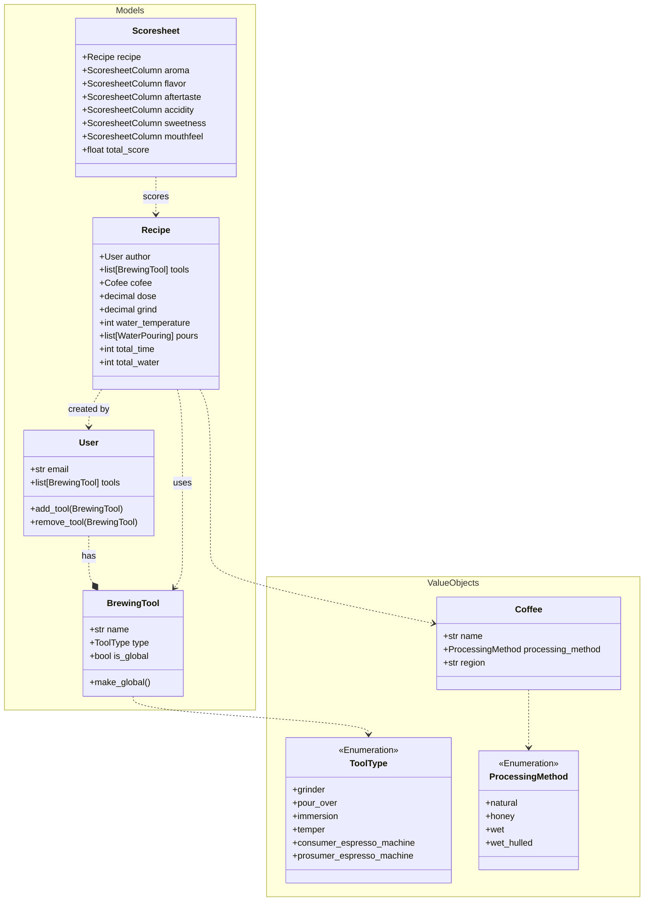

## Classes

```mermaid
classDiagram

namespace Models {
	class User {
		+str email
		+list[BrewingTool] tools
		+add_tool(BrewingTool)
		+remove_tool(BrewingTool)
	}

	class BrewingTool {
		+str name
		+ToolType type
		+bool is_global
		+make_global()
	}

	class Recipe {
		+User author
		+list[BrewingTool] tools
		+Cofee cofee
		+decimal dose
		+decimal grind
		+int water_temperature
		+list[WaterPouring] pours
		+int total_time
		+int total_water
	}

	class Scoresheet {
		+Recipe recipe
		+ScoresheetColumn aroma
		+ScoresheetColumn flavor
		+ScoresheetColumn aftertaste
		+ScoresheetColumn accidity
		+ScoresheetColumn sweetness
		+ScoresheetColumn mouthfeel
		+float total_score
	}
}

namespace ValueObjects {
	class ToolType {
		<<Enumeration>>
		+grinder
		+pour_over
		+immersion
		+temper
		+consumer_espresso_machine
		+prosumer_espresso_machine
	}
	
	class Coffee {
		+str name
		+ProcessingMethod processing_method
		+str region
	}
	
	class ProcessingMethod {
		<<Enumeration>>
		+natural
		+honey
		+wet
		+wet_hulled
	}
}

User ..* BrewingTool : has
Recipe ..> User : created by
Recipe ..> BrewingTool : uses
Scoresheet ..> Recipe : scores
Recipe ..> Coffee
BrewingTool ..> ToolType
Coffee ..> ProcessingMethod
```

